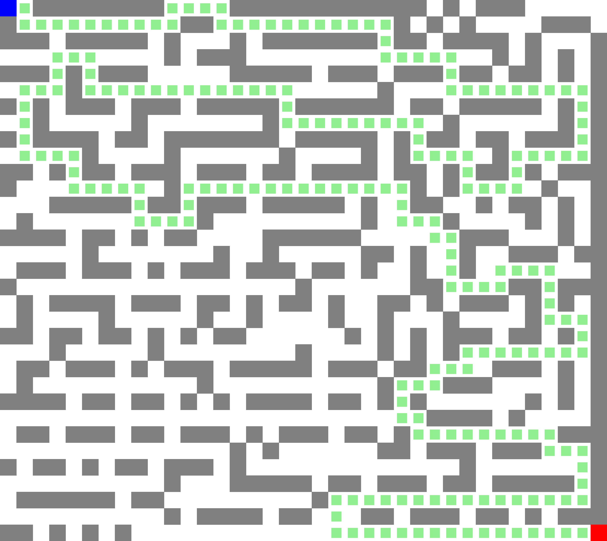
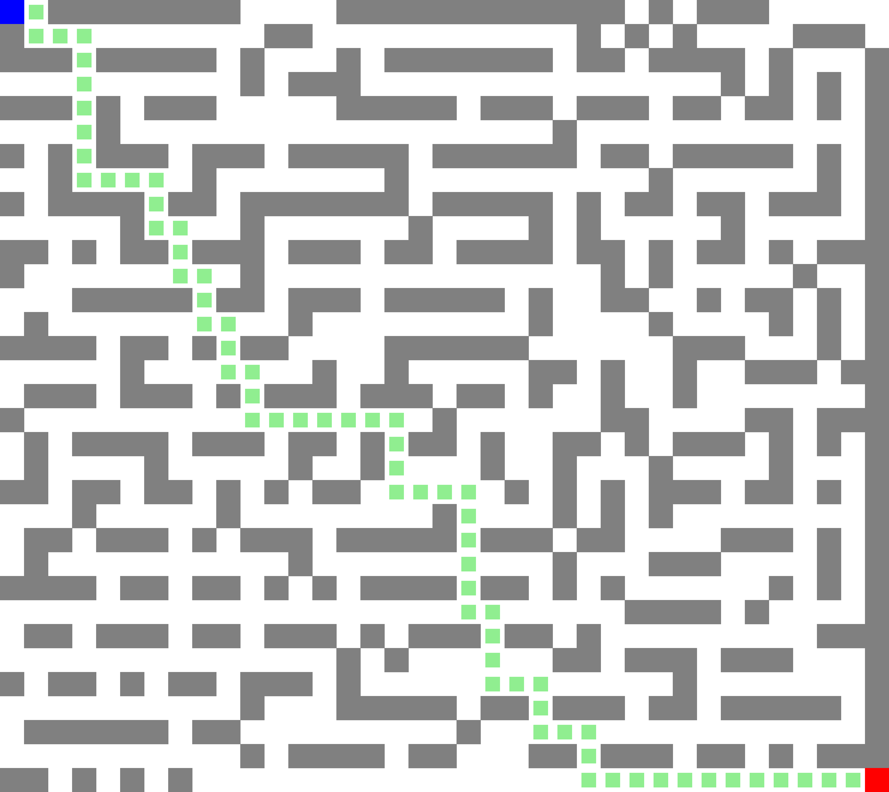

# Maze Solver

## Author: Aryan Agrawal

This project implements a maze-solving program using four different algorithms:
1. Breadth-First Search (BFS)
2. Depth-First Search (DFS)
3. Greedy Best-First Search
4. A* Search

The program reads a maze from a `maze.txt` file, solves it using each algorithm, and generates visual representations of the paths as PNG images.

---

## Algorithms Overview

### 1. Breadth-First Search (BFS)
- Explores all possible paths level by level.
- Guarantees the shortest path.

### 2. Depth-First Search (DFS)
- Explores as far as possible along each branch before backtracking.
- Does not guarantee the shortest path.

### 3. Greedy Best-First Search
- Uses a heuristic (Manhattan distance) to guide the search.
- May not find the shortest path but is faster than BFS and DFS.

### 4. A* Search
- Combines the actual cost from the start node and a heuristic to guide the search.
- Guarantees the shortest path.

---

## Maze Input Format

The maze should be provided in a text file named `maze.txt` with the following conventions:
- `#` represents walls.
- `S` is the start position.
- `G` is the goal position.
- '.' are navigable paths.

### Example Maze
```
# # # # #
# S . . #
# . # . #
# . G . #
# # # # #
```

---

## Visualization

The program generates images showing the solution paths for each algorithm. Below are previews of the results:

### BFS Solution


### DFS Solution


### Greedy Best-First Search Solution


### A* Solution


---

## Performance Comparison

| Algorithm                | Number of States Explored |
|--------------------------|---------------------------|
| **BFS**                 | 700                       |
| **DFS**                 | 548                       |
| **Greedy Best-First**   | 75                        |
| **A***                  | 254                       |

---
